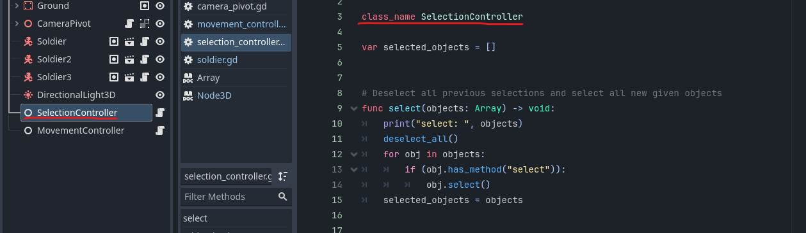
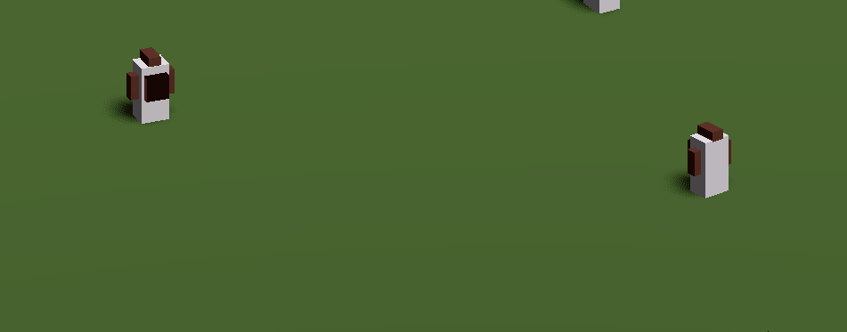
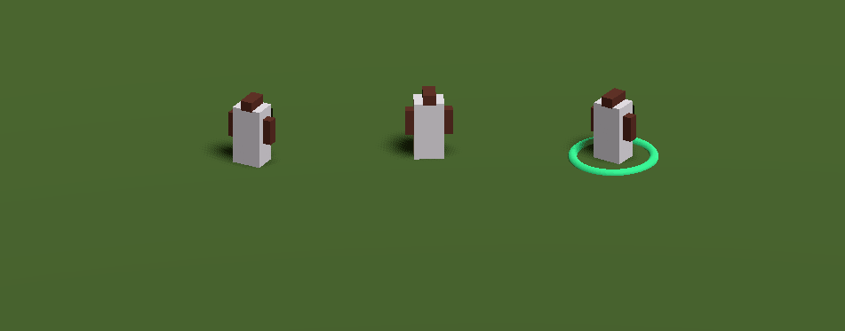
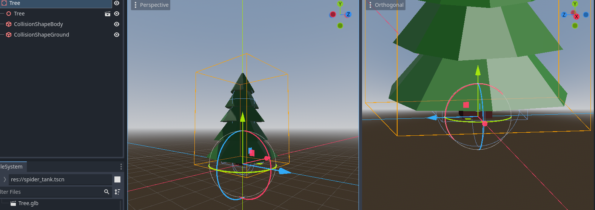

+++
title = 'Wo gehts lang?'
date = 2023-12-12T20:11:35+01:00
publishDate = 2023-12-24T12:00:00+00:00
draft = false
tags=["godot","games","programming"]
categories=["godot"]
[cover]
image = "thumbnail.png"
+++

Jetzt beginnt das herumspielen in einer Spiel-Engine mit Blender und allem drum und dran. Es ist so schön mal wieder
den `Default-Cube` zu sehen und direkt zu lös... NEIN! Der `Cube` in Blender wurde ein bisschen skaliert, gedreht,
dupliziert geschoben und geschoben, noch ein bisschen angemalt und fertig ist mein erster Charakter 🥳

## Alles ist eine Scene



Ich muss mich noch an den Gedanken gewöhnen, dass alles in Godot eine Scene ist. Also habe ich ersteinmal eine Welt gebaut und mit einem Boden versehen. Anschließend das Licht eingeschalten und meinen Charakter platziert. Dann den Charakter wieder entfernt, weil er seine eigene Scene bekommt 😇

Jetzt wollte ich die `Selektions-` und `Movememntlogik` in einen eigenen Bereich auslagern und dachte: "Das wird ein Object!". Also eine `Node` meiner Welt hinzugefügt, die nur ein `Script` erhalten. Losgeschrieben und an den richtigen stellen verknüpft.

```python
var selectionController: SelectionController = null
var movementController: MovementController = null

# Called when the node enters the scene tree for the first time.
func _ready():
    selectionController = get_node("../SelectionController")
    movementController = get_node("../MovementController")
```

Jetzt können `Scripte` aber auch als variable direkt mit `preload` verwendet werden. Ist das dann eine Instanz dieser Klasse? Ist dann doch nicht alles eine Scene? Das `preload` ist auch nicht nötig, wenn `class_name` bei dem einzubindenden Script verwendet wurde. Dann ist die Klasse direkt abrufbar.

## Raycasting und Pfade



## Bug 01



Das ist nicht der allererste Fehler den ich bis jetzt geschrieben habe, aber ein Problem, das ich jetzt noch nicht direkt lösen möchte. Ich muss halt die `Collision` mit dem Spielermodell beim `Rechts+Click` ignorieren und vielleicht braucht meine Welt auch `Gravity`?! Ich habe mich aber sehr gefreut darüber 🙃

## Bäume pflanzen - kann ich



Vielleich liegt es an der Weihnachtszeit und meinem tristen Spielfeld... Deswegen habe ich mir ein paar Bäumchen gepflanzt. Ich habe noch keine Ahnung welchen Style das Spiel haben wird, aber in der Low-Poly Welt konnte ich immer ziemlich schnell brauchbare Gegenstände modellieren 🙃 Jetzt bekam ich probleme mit der `move_and_slide` Methode, die meinen Character an der Baumgrenze einfach festgesetzt hat. Also nehme ich mit, dass für mein Spiel aktuell `move_and_collide` besser geeignet ist. In Zukunft sollte ich mir auch den [NavigationServer3D](https://docs.godotengine.org/en/stable/tutorials/navigation/navigation_using_navigationservers.html) anschauen.

## Der erste Gegner ist da
