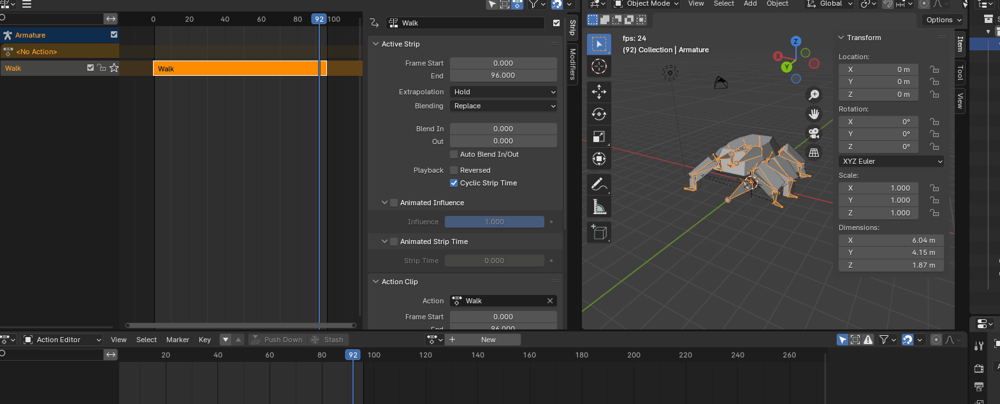

+++
title = '#02 Wo gehts lang?'
date = 2023-12-24T12:00:00+00:00
draft = false
tags=["godot","games","programming"]
categories=["godot"]
[cover]
image = "thumbnail.png"
+++

Jetzt beginnt das herumspielen in einer Spiel-Engine mit Blender und allem drum und dran. Es ist so schön mal wieder
den `Default-Cube` zu sehen und direkt zu lösc... NEIN! Der `Cube` in Blender wurde ein bisschen skaliert, gedreht,
dupliziert geschoben und geschoben, noch ein bisschen angemalt und fertig ist mein erster Charakter 🥳

## Alles ist eine Scene


Ich muss mich noch an den Gedanken gewöhnen, dass alles in Godot eine Scene ist. Also habe ich ersteinmal eine Welt gebaut und mit einem Boden versehen. Anschließend das Licht eingeschalten und meinen Charakter platziert. Dann den Charakter wieder entfernt, weil er seine eigene Scene bekommt 😇

Jetzt wollte ich die `Selektions-` und `Movememntlogik` in einen eigenen Bereich auslagern und dachte: "Das wird ein Object!". Also eine `Node` meiner Welt hinzugefügt, die nur ein `Script` erhalten. Losgeschrieben und an den richtigen stellen verknüpft.

```python
var selectionController: SelectionController = null
var movementController: MovementController = null

# Called when the node enters the scene tree for the first time.
func _ready():
    selectionController = get_node("../SelectionController")
    movementController = get_node("../MovementController")
```

Jetzt können `Scripte` aber auch als variable direkt mit `preload` verwendet werden. Ist das dann eine Instanz dieser Klasse? Ist dann doch nicht alles eine Scene? Das `preload` ist auch nicht nötig, wenn `class_name` bei dem einzubindenden Script verwendet wurde. Dann ist die Klasse direkt abrufbar.

## Raycasting und Pfade


Ein bisschen Selection-Control hier, eine Instanzierung von Entities dort, arbeiten mit Collisions (Layer, Static ....) et voilà - ich habe ein simples aber nettes herumkommandieren von meinen Einheiten. Dabei auch gleich ein paar Tastenkombination umgesetzt:

- `links+click`
- `alt+links+click`
- `str+links+click`
- `...`

## Bug 01


Das ist nicht der allererste Fehler, den ich bis jetzt geschrieben habe, aber ein Problem, das ich jetzt noch nicht direkt lösen möchte. Ich muss halt die `Collision` mit dem Spielermodell beim `Rechts+Click` ignorieren und vielleicht braucht meine Welt auch `Gravity`?! Ich habe mich aber sehr gefreut darüber 🙃

## Bäume pflanzen - kann ich


Vielleich liegt es an der Weihnachtszeit und meinem tristen Spielfeld... Deswegen habe ich mir ein paar Bäumchen gepflanzt. Ich habe noch keine Ahnung welchen Style das Spiel haben wird, aber in der Low-Poly Welt konnte ich immer ziemlich schnell brauchbare Gegenstände modellieren 🙃 Jetzt bekam ich probleme mit der `move_and_slide` Methode, die meinen Character an der Baumgrenze einfach festgesetzt hat. Also nehme ich mit, dass für mein Spiel aktuell `move_and_collide` besser geeignet ist. In Zukunft sollte ich mir auch den [NavigationServer3D](https://docs.godotengine.org/en/stable/tutorials/navigation/navigation_using_navigationservers.html) anschauen.

## Der erste Gegner ist da

Hier ist es, der Schrecken aus der Tiefe, ein Koloss der alten Zeit, der Terror aus dem All. Ganz ehrlich, ich habe noch keine Ahnung wo es hingeht und was die Geschichte wird. Für meinen ersten POC ist das auch nicht relevant. Hauptsache ist, dass meine Minions verfolgt und gefressen werden 😈

Hacky, hacky, eine Sphere-Collision eingebaut, die Pfadfindung grob kopiert und meiner kleinen Einheit wird hinterhergelaufen 😅

## Wir brauchen mehr Damage

Langsam fügt sich das alles ein bisschen mehr zusammen. Auch mit mehr Scripten und Code kann versucht werden, eine grobe Struktur zu Bauen. Generalisierte Spielobjekte mit Teamzugehörigkeit und Angriffen, die sich abmelden, wenn sie kein Leben mehr haben und von der Spielfläche verschwinden.

## Riggeldy, Wobbeldy



Endlich wieder Riggen in Blender 🥳 Es bringt zu viel Spaß, seine Spielobjekte zum Leben zu erwecken. Der Gltf Export mit den Actions war ein kleiner Krampf, aber mit einem Momentanen Workaround hat das auch funktioniert. Jetzt kann dir Jagd so richtig beginnen.
