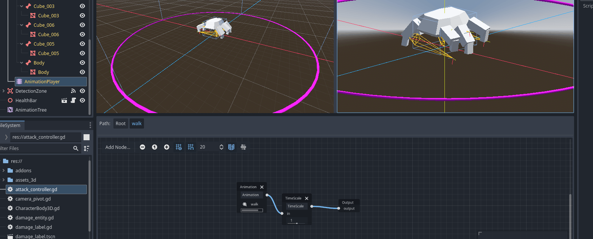
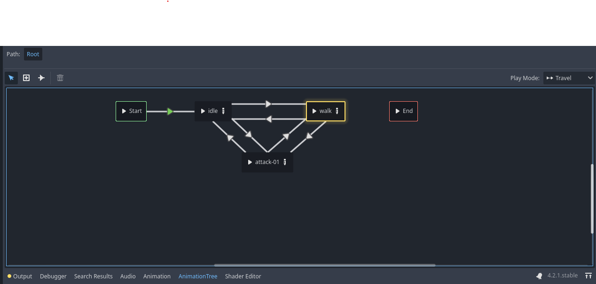
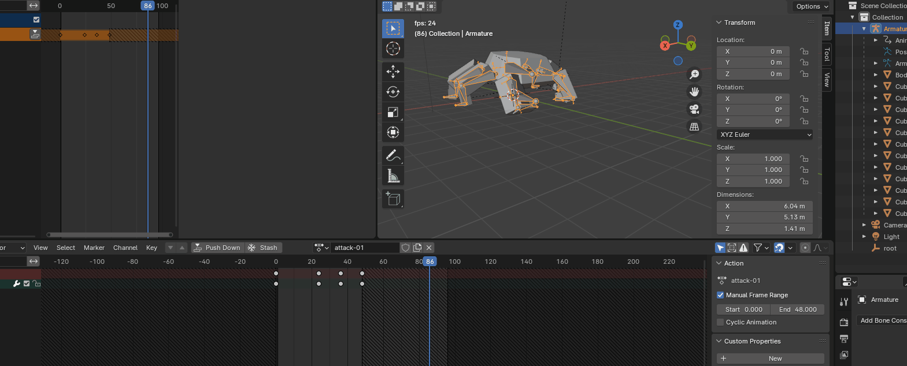
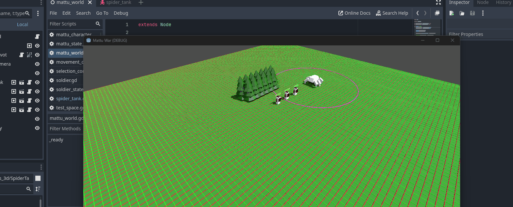
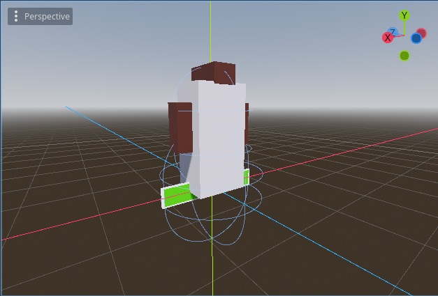
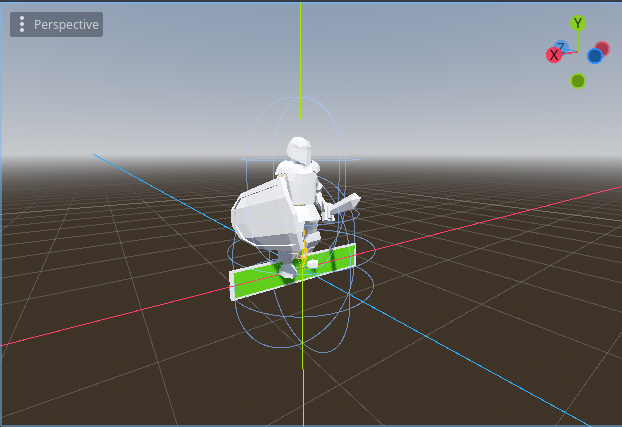

+++
title = '#03 States, States - wir brauchen States'
date = 2024-01-09T12:00:00+00:00
draft = true
tags=["godot","games","programming"]
categories=["godot"]
[cover]
image = "thumbnail.png"
+++

Es ist so einiges passiert über die Feiertage. Neben der schönen Winterzeit bin ich auch ein bisschen zum Coden, Modellieren und Riggen gekommen. Also ist hier mein Update zum Jahreswechsel

## Erstellen einer StateMachnine

Über dieses Thema werde ich noch einen eigenen Artikel schreiben, aber das hier hat mir wirklich Spaß gebracht. Es hat mir auch ein bisschen mehr dabei geholfen, den _Godot-Weg_ weiter zu verinnerlichen. Leider habe ich schmerzlich `Generics` vermisst und habe auf Typensicher `States` verzichtet. Jetzt geht alles über primitive `Strings` und ausschließlich Tests während der Laufzeit. Vielleicht finde ich ja noch einen besseren Weg zu einem späteren Zeitpunkt.

Meine `StateMachine` erbt von einem normalen `Node`. Sie hat den `State` und die `Transition` als `Inner Class`.

Erzeugen einer `StateMachine`:

```python
behaviour_machine = MattuStateMachine.new()
```

Erzeugen von den `Transitions`:

```python
var walk_transition := MattuStateMachine.MattuStateTransition.new()
walk_transition.event = "walk"
walk_transition.to = "walk"

var stop_transition := MattuStateMachine.MattuStateTransition.new()
stop_transition.event = "stop"
[...]
```

Erzeugen der `States` mit den verknüpften `Transitions`:

```python
var walking_state := MattuStateMachine.MattuState.new()
walking_state.name = "walk"
walking_state.on_enter = func():
    [...]
walking_state.on_exit = func():
    [...]
walking_state.add_transition(stop_transition)
walking_state.add_transition(attack_transition)
```

Abschließendes Füttern der `StateMachine` mit den einzelnen `States`:

```python
behaviour_machine.add_state(idle_state)
behaviour_machine.add_state(walking_state)
behaviour_machine.add_state(attacking_state)
```

## Kennenlernen vom AnimationTree

Dieser Abschnitt war ein bisschen hakelig und hat mich wirklich nicht so ganz überzeugt. Vielleicht habe ich auch während der Bahnfahrt und beim kleinen Zwischendurch-Coden das Große-Ganze nicht erkannt. Am Ende war ich verwirrt.



Jetzt hatte ich meine Spinne die läuft in Godot 🥳 Aber damit fingen die Probleme erst an... Als nächstes wollte ich zwischen den einzelnen Animtation (`Walk`, `Idle`, `Attack`) wechseln können. Diese Funktionalitäten Versprach ich mir von dem `AnimationNodeStateMachine` (toller Name). Ich dachte schon, dass meine eigene `SateMachine` damit überflüssig ist und habe mich in dieses neue Modul eingearbeitet.

Einige Tutorials, Dokumentationen und YouTube Videos später hatte cih mir eher schlecht als Recht den `AnimationTree` zusammengebastelt. Vor allem die Einstellungen und das Handling des `AnimationNodeStateMachine` waren eher _geht so_.



## Ausführen einer Attacke

Jetzt sollte mein Gegner aber nich nur Laufen, sondern auch Angreifen können! Also ab zurück nach Blender und den Node-Editor angeschmissen. (Tipp: nie vergessen, `Fake User` bei den Actions anzulegen damit sie nicht auf einmal _verschwinden_)



## Das kleine extra "-loop"

Angefangen mit einem `AnimationTree` mit einer `AnimationNodeStateMachine` habe ich nicht verstehen können, warum meine Animationen nur einmalig abgespielt werden. Bis ich irgendow darüber gestolpert bin, dass bei der Bennenung der `Action` in `Blender` die Nameserweiterung `-loop` gesetzt werden kann, damit die Animationen beim `gltf` in einer Schleife abgespielt werden... Obviously 🙃

## Erstellen der logischen Kette

Jetzt fing das Problem mit dem `AnimationTree` egtl. erst richtig an. Damit die Animation vom `walk` zu meiner zurückgelegten Distanz passt, musste ich meine Geschwindigkeit im Player anpassen... und das war wirklich nicht so einfach herauszufinden. Schlussendlich habe ich jeden `State` meines `AnimationTree` zu einem `BlendTree` gemacht, um die Geschwindigkeit skalieren zu könnnen.

Als lernte ich das `travel()` der `AnimationNodeStateMachine` kennen - eine ziemlich nice Idee. Hab sie eingebaut, mit meiner `StateMachine` verheiratet... und TADADA: Gehen und dann Angreifen, kann se.



## Ignorieren vom AnimationTree

Dann ging das nervige testen los:

- Wie unterbreche ich eine Animation?
- Wie kann ich über den Code die Animationsgeschwindigkeit an die Lauf- oder Angriffsgeschwindigkeit anpassen?
- Warum eigentlich nicht einfach nur einen simplen `AnimationPlayer` ohne den `AnimationTree`?

Die letzte Frage hat mich so lange gewurmt, bei dem ganzen rumgeklicke im `AnimationTree`, bis ich es einfach ohne den Tree direkt mit dem Player probiert habe. Beim ersten Versuch fühlte es sich einfach viel sinniger an. Ich konnte direkt die Geschwindigkeit und den Fade in einer Methode setzen - irre:

```python
animation_player.play(animation_name, .2)
```

Also, weg mit dem `AnimaitonTree` und hallo `AnimationPlayer` 😊

## Der CubeOfDestiny bekommt ein Update

Damit ich auch endlich eine Schlacht beobachten kann, musste der `CubeOfDestiny` einem neuen Look weichen. Mit hin-her, her-hin, Zweifeln und ein bisschen mehr Zeit durch Corona, habe ich meinen zweiten ziemlich passablen Characte gebastelt:

|VORHER|NACHHER|
|:--:|:--:|
|||
