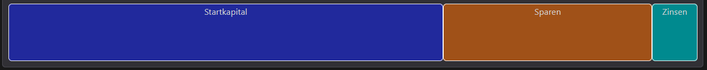

+++
title = 'Mattu-Credit - visuelle Motivation zum sparen'
date = 2024-01-13T12:00:00+00:00
draft = false
tags=["project", "finance", "vue"]
categories=["projects"]
[cover]
image = "thumbnail.png"
+++

Hier habe ich schnell und hacky mit `Vue3` einen Zinsrechner fürs sparen gebastelt.

- <https://mattesschu.github.io/mattu-credit/>

Die Idee:

- 🛫 Startkapital angeben
- 💸 monatl. Sparziel festlegen
- 🏦 Erwarteten Jahreszins angeben
- 📅 Zeitraum definieren
- 🏁 Wissen was so möglich wäre
- ... Träumen was hätte sein können

Am Ende bin ich ganz zufrieden mit dem Ergebnis und habe noch ein `CSS grid` als `Barchart` verwendet xD

Dann noch eine Aufschlüsselung der einzelnen Jahre:

